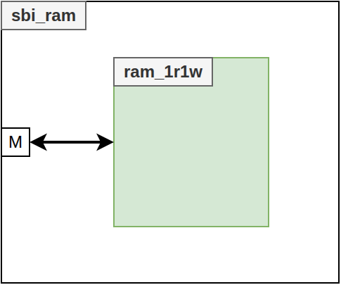

<!--
  README GENERATION INSTRUCTIONS (for the next regeneration run)
  ----------------------------------------------------------------
  This README follows the common Asylum IP model. Regenerate it from the
  sources, never from the previous README text alone.

  Sources of truth (in priority order):
    1. hdl/*.vhd            : entities, generics, ports, packages
    2. hdl/csr/*.hjson      : register map (regtool); *_csr.md/.h are generated
    3. <IP>.core            : VLNV (name), filesets, targets, depends, revisions
    4. mk/targets.txt       : target list shown by `make help`; mk/defs.mk
    5. sim/, syn/, esw/, boards/ : testbenches, constraints, software
  Section order (keep it, same headings in every IP):
    CI badge / Title + one-line description + VLNV / Table of Contents /
    Introduction (Key Features) / Block Diagram / Top-Level (Parameters,
    Ports, Instantiation Example) / HDL Modules / Register Map /
    Verification / Synthesis / Design Notes (optional) /
    Directory Structure / Dependencies
  Rules:
    - Language: English. Tables: Parameters = Name|Type|Default|Description,
      Ports = Name|Direction|Type|Description (grouped by interface).
    - Register Map: link to the generated hdl/csr/<X>_csr.md (plus the
      .hjson source and _csr.h header); never copy register tables here.
    - Top-Level = sbi_* wrapper if present, else the entity used by the
      `default` target, else the main entity (libraries: list packages).
    - Write "This IP has no software-visible registers." / "No dedicated
      synthesis target ..." instead of removing a section.
    - Keep still-accurate hand-written content (ISA tables, results,
      images) in "Design Notes"; drop anything not backed by the sources.
    - Block diagram: doc/<NAME>.drawio (NAME = 4th field of the VLNV),
      top entity box with generics on top, inputs left, outputs right,
      bus interfaces as bold arrows, internal blocks colour-coded
      (CSR yellow, FIFO/memory green, core logic blue, external grey).
      Update it whenever ports/generics/sub-blocks change.
    - Do not edit generated files (hdl/csr/*_csr.*) or the CI badge URL.
-->
[](https://github.com/deuskane/asylum-component-ram/actions/workflows/ci.yml)

# asylum-component-ram

**Generic inferred RAMs (1R1W, 2R1W, single-port 1RW) with asynchronous or synchronous read, plus an SBI memory-mapped RAM wrapper.**

VLNV: `asylum:component:ram:1.2.3`

## Table of Contents

1. [Introduction](#introduction)
2. [Block Diagram](#block-diagram)
3. [Top-Level](#top-level)
4. [HDL Modules](#hdl-modules)
5. [Register Map](#register-map)
6. [Verification](#verification)
7. [Synthesis](#synthesis)
8. [Design Notes](#design-notes)
9. [Directory Structure](#directory-structure)
10. [Dependencies](#dependencies)

## Introduction

This IP gathers the behavioural RAM models of the Asylum project, written to be inferred by synthesis tools: `ram_1r1w` (one read port, one write port), `ram_2r1w` (two read ports, one write port, e.g. register files) and `ram_1rw` (single shared port). All of them share the same generics (`WIDTH`, `DEPTH`, `SYNC_READ`) and a clock enable. `sbi_ram` wraps `ram_1rw` as an SBI target so that a processor can use it as data memory; it is the top-level documented below. `ram_1r1w` is also the storage of `asylum:component:fifo`.

### Key Features

- Generic word width (`WIDTH`) and number of words (`DEPTH`), address width `log2(DEPTH)`
- `SYNC_READ = false`: combinational read; `SYNC_READ = true`: registered read gated by the read enable
- Synchronous write on the rising edge of `clk_i`, clock enable `cke_i` on all ports
- No reset on the memory array (RAM / block-RAM inference friendly)
- `sbi_ram`: SBI target, data width taken from the SBI bus, zero wait state (`SYNC_READ = false`) or one wait state (`SYNC_READ = true`)
- `sbi_ram` reports its name in `sbi_tgt_o.info` (`NAME`, or `"RAM<DEPTH>B"` by default)
- Component declarations of all entities in `asylum.ram_pkg`

## Block Diagram



- `sbi_ini_i.cs`, `we`, `addr(log2(DEPTH)-1 downto 0)` and `wdata` drive the single port of `u_ram_1rw` (`cke_i = '1'`); `sbi_ini_i.re` is not used.
- The RAM output is connected directly to `sbi_tgt_o.rdata`; the RAM width is `sbi_ini_i.wdata'length`.
- The ready logic returns `sbi_tgt_o.ready = cs` with `SYNC_READ = false`, or a registered `ready_r` (high one cycle after `cs`) with `SYNC_READ = true`.
- `sbi_tgt_o.info.name` is `to_sbi_name(NAME)`, or `to_sbi_name("RAM" & to_string(DEPTH) & "B")` when `NAME = ""`.
- `ram_1r1w` and `ram_2r1w` are standalone entities, not used by `sbi_ram`.

## Top-Level

Top-level entity: **`sbi_ram`** ([hdl/sbi_ram.vhd](hdl/sbi_ram.vhd)), library `asylum`, component declared in `asylum.ram_pkg`.

### Parameters

| Name | Type | Default | Description |
|------|------|---------|-------------|
| `NAME` | string | `""` | Instance name returned in `sbi_tgt_o.info.name`; `""` gives `"RAM<DEPTH>B"` (e.g. `RAM256B`) |
| `DEPTH` | natural | `256` | Number of words, power of 2; the RAM instance uses `2**log2(DEPTH)` words (rounded down to a power of 2 to match the address width; a simulation assertion of severity `error` reports a `DEPTH` that is not a power of 2) |
| `SYNC_READ` | boolean | `false` | `false`: asynchronous read, `ready = cs`; `true`: synchronous read, one wait state |

### Ports

#### Clock & Reset

| Name | Direction | Type | Description |
|------|-----------|------|-------------|
| `clk_i` | in | std_logic | Clock |
| `arst_b_i` | in | std_logic | Asynchronous reset, active low (only resets `ready_r`, used when `SYNC_READ = true`) |

#### Bus (SBI)

| Name | Direction | Type | Description |
|------|-----------|------|-------------|
| `sbi_ini_i` | in | sbi_ini_t | SBI request from the initiator (`cs`, `we`, `addr`, `wdata`; `re` unused). `addr` must have at least `log2(DEPTH)` bits |
| `sbi_tgt_o` | out | sbi_tgt_t | SBI response to the initiator (`ready`, `rdata`, `info`) |

### Instantiation Example

```vhdl
library asylum;
use     asylum.sbi_pkg.all;
use     asylum.ram_pkg.all;

  ins_sbi_ram : entity asylum.sbi_ram
    generic map
    ( NAME      => "RAM0"
     ,DEPTH     => 128
     ,SYNC_READ => true
    )
    port map
    ( clk_i     => clk
     ,arst_b_i  => arst_b
     ,sbi_ini_i => sbi_inis(RAM0_ID)  -- sbi_ini_t(addr(7 downto 0), wdata(7 downto 0))
     ,sbi_tgt_o => sbi_tgts(RAM0_ID)  -- sbi_tgt_t(rdata(7 downto 0))
    );
```

With `DEPTH = 128`, the RAM decodes `addr(6 downto 0)`; the data width is the width of the `wdata` / `rdata` fields of the connected SBI signals (`SBI_DATA_WIDTH = 8` in `asylum.sbi_pkg`).

## HDL Modules

| File | Unit | Kind | Role |
|------|------|------|------|
| [hdl/ram_pkg.vhd](hdl/ram_pkg.vhd) | `ram_pkg` | package | Component declarations of `ram_1r1w`, `ram_1rw`, `ram_2r1w` and `sbi_ram` |
| [hdl/ram_1r1w.vhd](hdl/ram_1r1w.vhd) | `ram_1r1w` | entity | RAM with one read port and one write port (used by `asylum:component:fifo`) |
| [hdl/ram_2r1w.vhd](hdl/ram_2r1w.vhd) | `ram_2r1w` | entity | RAM with two read ports and one write port |
| [hdl/ram_1rw.vhd](hdl/ram_1rw.vhd) | `ram_1rw` | entity | Single-port RAM (shared address, `cs` / `we`) |
| [hdl/sbi_ram.vhd](hdl/sbi_ram.vhd) | `sbi_ram` | entity | Top-level: SBI target wrapper around `ram_1rw` |

### ram_1r1w

#### Parameters

| Name | Type | Default | Description |
|------|------|---------|-------------|
| `WIDTH` | natural | `32` | Word width in bits |
| `DEPTH` | natural | `32` | Number of words, power of 2 (simulation assertion of severity `error` otherwise) |
| `SYNC_READ` | boolean | `false` | `false`: combinational read (`re_i` ignored); `true`: registered read when `cke_i = re_i = 1` |

#### Ports

| Name | Direction | Type | Description |
|------|-----------|------|-------------|
| `clk_i` | in | std_logic | Clock |
| `cke_i` | in | std_logic | Clock enable (write and synchronous read) |
| `re_i` | in | std_logic | Read enable (`SYNC_READ = true` only) |
| `raddr_i` | in | std_logic_vector(log2(DEPTH)-1 downto 0) | Read address |
| `rdata_o` | out | std_logic_vector(WIDTH-1 downto 0) | Read data |
| `we_i` | in | std_logic | Write enable |
| `waddr_i` | in | std_logic_vector(log2(DEPTH)-1 downto 0) | Write address |
| `wdata_i` | in | std_logic_vector(WIDTH-1 downto 0) | Write data |

### ram_2r1w

#### Parameters

| Name | Type | Default | Description |
|------|------|---------|-------------|
| `WIDTH` | natural | `32` | Word width in bits |
| `DEPTH` | natural | `32` | Number of words, power of 2 (simulation assertion of severity `error` otherwise) |
| `SYNC_READ` | boolean | `false` | `false`: combinational reads (`re0_i` / `re1_i` ignored); `true`: each read port registered when `cke_i` and its `re*_i` are 1 |

#### Ports

| Name | Direction | Type | Description |
|------|-----------|------|-------------|
| `clk_i` | in | std_logic | Clock |
| `cke_i` | in | std_logic | Clock enable (write and synchronous reads) |
| `re0_i` | in | std_logic | Read enable, port 0 (`SYNC_READ = true` only) |
| `raddr0_i` | in | std_logic_vector(log2(DEPTH)-1 downto 0) | Read address, port 0 |
| `rdata0_o` | out | std_logic_vector(WIDTH-1 downto 0) | Read data, port 0 |
| `re1_i` | in | std_logic | Read enable, port 1 (`SYNC_READ = true` only) |
| `raddr1_i` | in | std_logic_vector(log2(DEPTH)-1 downto 0) | Read address, port 1 |
| `rdata1_o` | out | std_logic_vector(WIDTH-1 downto 0) | Read data, port 1 |
| `we_i` | in | std_logic | Write enable |
| `waddr_i` | in | std_logic_vector(log2(DEPTH)-1 downto 0) | Write address |
| `wdata_i` | in | std_logic_vector(WIDTH-1 downto 0) | Write data |

### ram_1rw

#### Parameters

| Name | Type | Default | Description |
|------|------|---------|-------------|
| `WIDTH` | natural | `32` | Word width in bits |
| `DEPTH` | natural | `32` | Number of words, power of 2 (simulation assertion of severity `error` otherwise) |
| `SYNC_READ` | boolean | `false` | `false`: combinational read of `addr_i`; `true`: registered read when `cke_i = cs_i = 1` and `we_i = 0` |

#### Ports

| Name | Direction | Type | Description |
|------|-----------|------|-------------|
| `clk_i` | in | std_logic | Clock |
| `cke_i` | in | std_logic | Clock enable (write and synchronous read) |
| `cs_i` | in | std_logic | Chip select |
| `we_i` | in | std_logic | Write enable (write when `cs_i = we_i = 1`, read when `cs_i = 1`, `we_i = 0`) |
| `addr_i` | in | std_logic_vector(log2(DEPTH)-1 downto 0) | Address (shared by read and write) |
| `wdata_i` | in | std_logic_vector(WIDTH-1 downto 0) | Write data |
| `rdata_o` | out | std_logic_vector(WIDTH-1 downto 0) | Read data |

## Register Map

This IP has no software-visible registers. `sbi_ram` is memory-mapped storage without CSR: every SBI address below `2**log2(DEPTH)` is a RAM word.

## Verification

### Testbenches

| File | DUT | Description |
|------|-----|-------------|
| [sim/tb_ram.vhd](sim/tb_ram.vhd) | `ram_1r1w`, `ram_2r1w`, `ram_1rw` and `sbi_ram` (testbench generics `WIDTH`, `DEPTH`, `SYNC_READ`) | Self-checking UVVM testbench. The three RAMs receive the same write stream (`ram_1rw`: `cs = we or re0`, address = write address when writing, else read address 0) and share one reference model; every cycle the read data of each port are compared with the model (combinational read, or the word registered by the last enabled read with `SYNC_READ = true`). Tests: 1) write all words; 2) read all words (port 1 in reverse order); 3) read and write of the same address in the same cycle (old word, then new word); 4) `cke_i = 0` blocks writes and registered reads; 5) read enable low holds the registered read data, a `ram_1rw` write does not update it; 6) 1000 random cycles (reads, writes, `cke_i`). `sbi_ram` through the SBI BFM (`bitvis_vip_sbi`): 7) write / check of all words, back-to-back write+check, wait states measured on every access (0 with `SYNC_READ = false`, 1 with `SYNC_READ = true`) and `ready` never set without `cs`; 8) address aliasing: the word written at `DEPTH+3` is read at `3`, `DEPTH+3`, `2*DEPTH+3`, `3*DEPTH+3`; 9) default `info.name = "RAM<DEPTH>B"`. `report_alert_counters(FINAL)` gives the verdict (4329 to 5342 checks per target) |

### Targets

| Target | Toplevel | Description |
|--------|----------|-------------|
| `default` | `ram_1r1w` | HDL fileset only (not a simulation) |
| `sim_basic` | `tb_ram` | All RAMs and `sbi_ram`, asynchronous read (`WIDTH=8`, `DEPTH=16`, `SYNC_READ=false`) |
| `sim_sync_read` | `tb_ram` | All RAMs and `sbi_ram`, synchronous read (`WIDTH=8`, `DEPTH=16`, `SYNC_READ=true`) |
| `sim_wide_async_read` | `tb_ram` | All RAMs and `sbi_ram`, asynchronous read (`WIDTH=32`, `DEPTH=64`, `SYNC_READ=false`) |
| `sim_wide_sync_read` | `tb_ram` | All RAMs and `sbi_ram`, synchronous read (`WIDTH=32`, `DEPTH=64`, `SYNC_READ=true`) |

The `.core` parameters `WIDTH` (int, 8), `DEPTH` (int, 16) and `SYNC_READ` (bool, false) are the testbench generics set by the `sim_*` targets (`DEPTH` must be a power of 2, at least 16).

### How to Run

The default tool is GHDL (`mk/defs.mk`: `TOOL ?= ghdl`, `TARGET ?= sim_basic`).

```bash
make help                 # variables, rules and target list (mk/targets.txt)
make sim_basic            # run one target (log in log/)
make nonreg_sim           # run every sim_* target
make clean                # remove build/
```

Equivalent FuseSoC command:

```bash
fusesoc --cores-root . run --build-root build --target sim_basic asylum:component:ram:1.2.3
```

### Simulation Features

- All `sim_*` targets analyze with `-Wall -fsynopsys -frelaxed --no-vital-checks` and run with `--fst=dut.fst --ieee-asserts=disable` (waveform always written to `dut.fst`).
- `ram_1r1w`, `ram_1rw`, `ram_2r1w` and `sbi_ram` assert (severity `error`, inside `pragma translate_off`) that `DEPTH` is a power of 2.

## Synthesis

No dedicated synthesis target. The HDL of the `default` target is synthesizable: the only simulation-only construct is the `DEPTH` power-of-2 assertion, enclosed in `pragma translate_off / translate_on` (no `textio`, file access or `wait`). The memory array is a plain signal array without reset, written synchronously, so it is inferred as RAM:

- `SYNC_READ = true`: registered read port(s), suitable for block RAM.
- `SYNC_READ = false`: asynchronous read, which maps to distributed / LUT RAM or registers.
- `ram_2r1w` needs two read ports on the same array (two RAM copies or a multi-port primitive, depending on the tool).
- Resource usage is `WIDTH x DEPTH` bits (`DEPTH` rounded down to a power of 2 in `sbi_ram`).

## Design Notes

### Read / Write Timing

- Writes happen on the rising edge of `clk_i` when `cke_i = 1` and the write condition is true (`we_i`, or `cs_i and we_i` for `ram_1rw`).
- Asynchronous read: `rdata` follows the read address combinationally; a word written on an edge is visible right after it.
- Synchronous read: `rdata` is the content at the address sampled on the edge (read-before-write: a read and a write to the same address on the same edge return the old word) and holds its value when the read enable is low.
- Address width is `log2(DEPTH)` (floor), so `DEPTH` must be a power of 2 to address every word: with another value the words `2**log2(DEPTH)` to `DEPTH-1` of `ram_*` are unreachable and `sbi_ram` is rounded down to `2**log2(DEPTH)` words. The rounding keeps the array size equal to the addressable range and the port widths unchanged; since it silently loses words, a simulation assertion now reports it.
- `sbi_ram` decodes only the `log2(DEPTH)` LSBs of the SBI address: higher addresses alias onto the RAM (the interconnect is expected to decode the base address).

### sbi_ram Handshake

- `SYNC_READ = false`: `ready = cs`, every access completes in the cycle it is issued.
- `SYNC_READ = true`: `ready_r <= cs and not ready_r`; `ready` rises one cycle after `cs` (the cycle in which the registered read data is valid) and falls the next cycle, so an access held until `ready` takes two cycles. A write with `cs` held for two cycles writes the same word twice.

## Directory Structure

```
asylum-component-ram/
├── ram.core                # FuseSoC core (asylum:component:ram)
├── Makefile                # Common Asylum Makefile (FuseSoC wrapper)
├── mk/
│   ├── defs.mk             # FILE_CORE, default TARGET and TOOL
│   └── targets.txt         # Target list (generated from the .core)
├── doc/
│   └── ram.drawio          # Block diagram
├── hdl/
│   ├── ram_pkg.vhd
│   ├── ram_1r1w.vhd
│   ├── ram_2r1w.vhd
│   ├── ram_1rw.vhd
│   └── sbi_ram.vhd
├── sim/
│   └── tb_ram.vhd          # UVVM testbench (all RAMs, sbi_ram)
└── .github/workflows/ci.yml  # CI (sim_basic, sim_sync_read, sim_wide_async_read, sim_wide_sync_read)
```

## Dependencies

| Core | Used by (fileset) | Purpose |
|------|-------------------|---------|
| `asylum:utils:pkg` | `files_hdl` | Common packages (`math_pkg`: `log2`; `sbi_pkg`: SBI records, `to_sbi_name`) |
| `bitvis:verification:uvvm` | `files_sim` | UVVM utility library and SBI BFM (`bitvis_vip_sbi`) |
